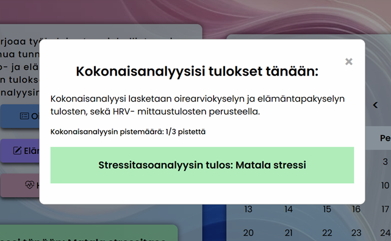

# MindEase Stressmanagement Application
## Overview
MindEase is a comprehensive stress management application designed specifically for college students and healthcare professionals. Utilizing heart rate variability (HRV) measurement, the application offers a science-based approach to monitoring and managing stress levels. By combining technological innovation with practicality, MindEase aims to improve the well-being and mental health of students, preparing them to be the innovators and leaders of tomorrow.

## Features
- **Personalized Guidance and Support:** Offers tailored relaxation exercises and lifestyle recommendations based on individual measurement data and survey responses. These personalized insights help users adopt healthier habits and manage stress more effectively.

- **Direct Communication with Healthcare Professionals:** Facilitates seamless communication between students and health professionals through the app, providing a platform for timely advice and professional support.

- **Data-Driven Insights:** Employs advanced analytics to process HRV data and user input from daily surveys on stress symptoms and lifestyle factors, enabling detailed reports and actionable insights.
Preventive Health Strategies: By identifying high stress levels early, MindEase allows for early intervention which can prevent the development of more serious health issues related to prolonged stress.

## References
This project uses a range of open-source tools and resources. Below is a list of these resources and their contributions to the project.

- **Kubios** - Premium software for heart rate variability analysis, used for detailed insights into stress levels. Note: Check the specific license details depending on your usage. [Kubios](https://www.kubios.com/)
- **Bootstrap Icons** - Icons used throughout the application for a consistent and modern UI. [View Icons](https://icons.getbootstrap.com/)
- **Chart.js**  Used for the HRV-data chart. [Chart.js](https://www.chartjs.org/)
  ```
  $ npm i chart.js
  ```
- **Chart.js plugin zoom**
  ```
  $ npm i chartjs-plugin-zoom
  ```
- **amCharts** - Used for the Stress Analaysis data chart. [amCharts](https://www.amcharts.com/)
  ```
  npm i @amcharts/amcharts5
  ```
- **bcryptjs** - Express library, that allows the safer storing of passwords by hashing the passwords.[Bcryptjs](https://github.com/kelektiv/node.bcrypt.js)
  ```
  $ npm install bcrypt
  ```
- **JWT** JSON Web Token. An express library, that allows the sending and storing of userdata to the frontend of the application for authorization purposes [jwt](https://jwt.io/)
  ```
  $ npm install jsonwebtoken
  ```
- **cors** - Cross-origin resquests sharing library. A mechanism to allow a server to specify any origins, other than its own, from which a browser should permit the loading of resources. [Cors](https://github.com/expressjs/cors)
  ```
  $ npm install cors
  ```
- **dotenv** - Express library, that allows the saving of environmental variables. [dotenv](https://github.com/motdotla/dotenv)
  ```
  $ npm install dotenv
  ```
- **express validator** - Express library, that allows validation of values submitted to the backend server. [express validator](https://express-validator.github.io/docs)
  ```
  $ npm install express-validator
  ```
- **MySQL** Database management system, that was used in the development and deployment of the application. [MySQL](https://www.mysql.com/)
- **mysql2** - Express library, that allows interactions with the MySQL DBSM. [mysql2](https://github.com/sidorares/node-mysql2)
  ```
  $ npm install --save mysql2
  $ npm audit fix
  $ nmp i mysql2
  ```
> [!WARNING]
> Make sure your using version 3.9.7 or higher of mysql2.

- **All the images seen in the application were generated by ChatGPT 4.** [ChatGPT](https://chatgpt.com/)

## Pictures of the application

### Login page of the application.


### Home page after logging in with client credentials.


### HRV measurement chart 


### Overall stressanalysis results



### Relaxing exercises


### Symptom survey


### Message

## Database design


"[Not in use]": Database tables that cannot be updated due to no functioning routes

"(FK)": Foreign key of the table

"(O)": Optional Field

underline row: Primary key of the table

## Start server in development server
```
npm run dev
```
tai
```
npm run start
```

# Routes

## Authentication/authorization endpoints
##
## /api/auth/login
##
### Login as a regular user
```
POST http://localhost:3000/api/auth/login
Content-Type: application/json

{
  "username" : "",  (should be email)
  "password": ""
}
```
##
## /api/auth/professional/
##
### Login as an admin/healthcare provider
```
POST http://localhost:3000/api/auth/professional/login
Content-Type: application/json

{
  "username" : "",  (should be email)
  "password": ""
}
```
##
## /api/auth/me
##
### Fetch user's data (requires token)
```
GET http://localhost:3000/api/auth/me
Authorization: Bearer
```
## User data related endpoints
##
## /api/users endpoint
##
### Fetcht all user data (requires token)
```
GET http://localhost:3000/api/users
Authorization: Bearer
```
### Fetch user data by user's id (requires token)
```
GET http://localhost:3000/api/users/6
Authorization: Bearer
```
### Create a new user
```
POST  http://localhost:3000/api/users
content-type: application/json

{
    "username": "",  (should be email)
    "password": "",
    "email" : "",  (should be email)
    "first_name": "",
    "last_name": ""
}
```
### Edit an existing user's data (requires token)
```
PUT http://localhost:3000/api/users/5
Authorization: Bearer
Content-Type: application/json

{
    "username": "",  (should be email)
    "password": "", 
    "first_name": "",
    "last_name": "",
    "chat_permission" : "",  (should be "yes" or "no")
    "chat_permission_date" : ""  (should be a date)
}
```
### Delete an existing user (requires token) 
```
DELETE http://localhost:3000/api/users/6
Authorization: Bearer
```
##
## /api/student routes
## 
### Fetch all student's ids and usernames (requires token)
```
GET http://localhost:3000/api/student/
Authorization: Bearer
```

## Symptom related endpoints
##
## /api/symptoms routes
##
### Fetch all entries in symptoms (requires token)
```
GET http://localhost:3000/api/symptoms/
Authorization: Bearer
```
### Create a new symptom entry (requires token)
```
POST http://localhost:3000/api/symptoms/
Authorization: Bearer
Content-Type: application/json

{
  "entry_date" : "2024-04-05",  (should be a date)
  "frustration" : "1",   (should be boolean)
  "grumpiness" : "1",   (should be boolean)
  "recall_problems": "1",  (should be boolean)
  "restlesness": "1",  (should be boolean)
  "disquiet": "1",  (should be boolean) 
  "tiredness": "1",  (should be boolean)
  "anxiety" : "1",  (should be boolean)
  "difficulty_making_decisions" : "1",  (should be boolean)
  "sleep_disturbances": "1",  (should be boolean)
  "changes_in_appetite": "1",  (should be boolean) 
  "headache": "1",  (should be boolean) 
  "neck_pain": "1",  (should be boolean) 
  "vertigo": "1",  (should be boolean) 
  "palpitation": "1",  (should be boolean) 
  "nausea": "1",  (should be boolean) 
  "upset_stomach": "1",  (should be boolean) 
  "recurring_colds": "1",  (should be boolean) 
  "back_issues": "1",  (should be boolean) 
  "stress_level": "5"  (should be integer between 1-5)
}
```
##
## /api/symptoms/:id routes
##
### Fetch all of the entries by user_id
```
GET http://localhost:3000/api/symptoms/11
Authorization: Bearer
```
### Edit an existing entry in symptoms (requires token)
```
PUT http://localhost:3000/api/symptoms/5
Authorization: Bearer 
Content-Type: application/json

{
  "frustration" : "1",  (should be boolean)
  "grumpiness" : "0",   (should be boolean)
  "recall_problems": "1",  (should be boolean) 
  "restlesness": "0",  (should be boolean) 
  "disquiet": "1",  (should be boolean) 
  "tiredness": "0",  (should be boolean) 
  "anxiety" : "1",  (should be boolean) 
  "difficulty_making_decisions" : "0",  (should be boolean)
  "sleep_disturbances": "1",  (should be boolean) 
  "changes_in_appetite": "0",  (should be boolean) 
  "headache": "1",  (should be boolean) 
  "neck_pain": "0",  (should be boolean) 
  "vertigo": "1",  (should be boolean) 
  "palpitation": "0",  (should be boolean) 
  "nausea": "1",  (should be boolean) 
  "upset_stomach": "0",  (should be boolean) 
  "recurring_colds": "1",  (should be boolean) 
  "back_issues": "0",  (should be boolean)
  "stress_level": "5",  (should be integer between 1-5)
  "user_id": "6"  (should be integer)
}
```
##
## /api/symptoms/user/:id
##
### Fetch symptom entries by user's id (requires token)
```
GET http://localhost:3000/api/symptoms/user/6
Authorzation: Bearer 
```
##
## /api/symptoms/:symptom_id/user/:user_id
##
### Fetch symptoms by symptom_id and user_id (requires token)
```
GET http://localhost:3000/api/symptoms/2/user/6
Authorization: Bearer 
```
### Delete entry in symptoms with symptom_id and user_id (requires token)
```
DELETE http://localhost:3000/api/symptoms/4/user/10
Authorization: Bearer
```

# Lifestyle data related endpoints
##
## /api/lifestyle/ routes
##

### Create a new lifestyle entry
```
POST http://localhost:3000/api/lifestyle/
Authotization: Bearer 

Content-Type: application/json

{
  "entry_date" : "2024-05-06",  (should be a date)
  "hours_slept" : "7.5",  (should be a number)
  "enough_sleep" : "yes",  (should be "yes" or "no")
  "quality_sleep" : "4",  (should be integer)
  "feel_healthy" : "yes",  (should be "yes" or "no")
  "caffeine_intake" : "4",  (should be a number)
  "nicotine_intake": "0",  (should be a number)
  "alcohol_intake": "0",  (should be a number)
  "physical_activity": "Juoksu",  
  "duration": "0.5",  (should be a number)
  "intensity": "3",  (should be a number)
  "user_id": "6"  (should be integer)
}
```
##
## /api/lifestyle/:id routes
##
### fetch lifestyle entries by user_id (requires token)
```
GET http://localhost:3000/api/lifestyle/6
Authorization: Bearer
```

# HRV data related endpoints
##
## /api/hrv
##
### Save a new hrv entry (requires token)
```
POST http://localhost:3000/api/hrv
Authorization: Bearer
Content-Type: application/json

{
  "entry_date" : "2024-05-05",  (should be date)
  "stress_index": "8.676786867394357",  (should be a number)
  "av_hrv": "931.5854922279792" ,  (should be a number)
  "mean_rr_ms" : "931.5854922279792",  (should be a number)
  "sdnn_ms": "47.26890774349144",  (should be a number)
  "readiness": "66.85579905808478"  (should be a number)
}
```
##
## /api/hrv/:id
##
### Fetch all user's hrv entries (requires token)
```
GET http://localhost:3000/api/lifestyle/6
Authorization: Bearer
```
# Analysis related endpoints

##
## /api/analysis routes
## 
### Fecth all entries in analysis (requires token)
```
GET http://localhost:3000/api/analysis/
Authorization: Bearer 
```
### Fetch entry by analysis id (requires token)
```
GET http://localhost:3000/api/analysis/3
Authorization: Bearer 
```
### Create a new analysis entry (requires token)
```
POST http://localhost:3000/api/analysis/
Authorization: Bearer
Content-Type: application/json

{
  "user_id": "10",  (should be integer)
  "analysis_result": "Korkea stressi",  (should be "Matala stressitaso", "Kohtalainen stressitaso" or "Korkea stressitaso")
  "analysis_enumerated": "1",  (should be integer between 1-3)
  "created_at": "2024-05-4"  (should be date)
}
```
### Edit an existing analysis entry (requires token) 
```
PUT http://localhost:3000/api/analysis/5
Authorization: Bearer 
Content-Type: application/json

{
  "user_id": "2",  (should be integer)
  "analysis_result": "Korkea stressi",  (should be "Matala stressitaso", "Kohtalainen stressitaso" or "Korkea stressitaso"")
  "analysis_enumerated": "3",  (should be integer between 1-3)
  "created_at": "2024-05-4"  (should be date)
}
```
##
## /api/analysis/user/ routes
##

### Fetch all analysis entries of a specific user (requires token)
```
GET http://localhost:3000/api/analysis/user/6
Authorization: Bearer 
```

##
## /api/analysis/:id/user/:id
##

### Delete a specific entry in analysis of a specific user (requires token)
```
DELETE http://localhost:3000/api/analysis/6/user/10
Authorization: Bearer
```

# Riskgroup data related endpoints


# Messages related endpoints

##
## /api/messages routes
##

### Fetch all messages (requires token)
```
GET http://localhost:3000/api/messages/
Authorization: Bearer
```

### Send a new message to a new conversation (requires token)
```
POST http://localhost:3000/api/messages/
Authorization: Bearer
Content-Type: application/json

{
  "recipient_id": "6",  (should be integer) 
  "message_content": "Hello",
  "message_sent_at" : "2024-05-05 14:02:00",  (should be ISO8601 date and/or time)
  "sender_id": "5"  (should be integer)
}
```

### Send a new message to an existing conversation (requires token)
```
POST http://localhost:3000/api/messages/
Authorization: Bearer
Content-Type: application/json

{
  "conversation_id" : "1",  (should be integer)
  "recipient_id": "6",  (should be integer)
  "message_content": "Hi",
  "message_sent_at" : "2024-05-05 14:02:00",  (should be ISO8601 date and/or time)
  "sender_id": "5"  (should be integer)
}
```
##
## /api/messages/:id routes
##
### Fetch message by message's id (requires token)
```
GET http://localhost:3000/api/messages/6
Authorization: Bearer
```
##
## /api/messages/conversation/:id routes 
##
### Fetch conversation by conversation id (requires token)
```
GET http://localhost:3000/api/messages/conversation/2
Authorization: Bearer 
```
##
## /api/conversation/user/:id routes
##
### Fetch conversation_id sender's or recipients's id (requires token)
```
GET http://localhost:3000/api/messages/user/5
Authorization: Bearer
```
##
## /api/messages/:id/user/:user_id
##
### Delete messages by message_id and user_id (requires token)
```
DELETE http://localhost:3000/api/messages/7/user/6
Authorization: Bearer
```
